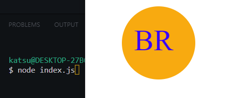

# svg-logo-maker

## Description

Uses node.js prompts to create an svg logo given user inputs of letters and shapes

## Usage

install dependencies "npm i"

Open file in Terminal using "node index.js"

